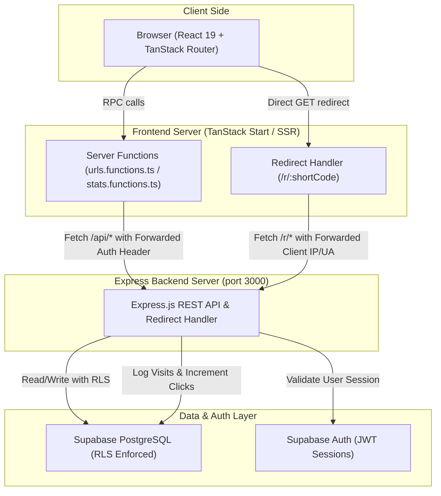
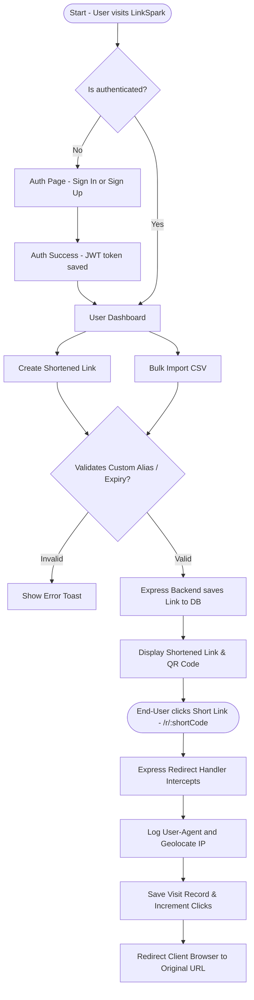

# LinkSpark — URL Shortener with Analytics

A production-grade URL shortener with real-time analytics, QR codes, custom aliases, expiry, public stats, and bulk CSV import.

---

## 🎬 Demonstration Video
- **[Link to Demo Video](YOUR_VIDEO_LINK_HERE)** 

*Note: Please replace the placeholder link above with your Loom or YouTube video link demonstrating and explaining your application.*

---

## 🛠️ Setup & Running Instructions

To run this project locally, follow these steps:

### Prerequisites
- Node.js (v18 or higher) or Bun
- A Supabase database project

### 1. Install Dependencies
```bash
# Using npm
npm install

# Using bun
bun install
```

### 2. Configure Environment Variables
Create a `.env` file in the root directory and configure your credentials:
```env
VITE_SUPABASE_PROJECT_ID="your-project-id"
VITE_SUPABASE_URL="https://your-project-id.supabase.co"
VITE_SUPABASE_PUBLISHABLE_KEY="your-anon-key"

SUPABASE_PROJECT_ID="your-project-id"
SUPABASE_URL="https://your-project-id.supabase.co"
SUPABASE_PUBLISHABLE_KEY="your-anon-key"
SUPABASE_SERVICE_ROLE_KEY="your-service-role-key"
```

### 3. Start the Application Servers
You must run both the backend Express API server and the frontend client development server:

**Start the Express backend (runs on port 3000):**
```bash
npm run server
```

**Start the React frontend (runs on port 8080):**
```bash
npm run dev
```

Open **[http://localhost:8080](http://localhost:8080)** in your browser.

---

## 📋 AI Planning Document

### 1. Planning the App
We planned the architecture of LinkSpark around three design goals: security (Row-Level Security), robust analytics (non-intrusive geolocating & client logging), and styling integrity (warm premium UI, solid black text readability).

- **Database Layer**: Implemented three schemas (`profiles`, `urls`, `visits`) with triggers to auto-generate profile records upon auth signup and auto-increment short link visit aggregates.
- **Backend Architecture**: Constructed a standalone Express.js backend that handles validation, persistence, IP-based geolocating, and server-side HTTP 302 redirects.
- **Frontend Architecture**: Built a SPA using TanStack Router for route protection and layout styling, TanStack Query for cache invalidation, and custom server function wrappers to delegate state fetching to the Express REST API.
- **Branding & Style**: Adopted a Burger King style guide theme consisting of warm cream backgrounds (`#f4f0ec`), warm borders (`#f0e6d7`), white cards, red brand accents (`#d62300`), and a global override ensuring all typography text is solid black (`#000000`) for high contrast legibility.

### 2. Feature Listing & Documentation
LinkSpark performs the following functions:

- **User Authentication**: Secure signup and signin powered by Supabase Auth (JWT storage).
- **Navbar Username Customization**: Displays the authenticated user's actual profile username (queried from the database `profiles` table) in the navbar instead of their email address.
- **URL Shortener Generator**: Shortens URLs by creating unique 7-character nanoids or custom alphanumeric aliases (`^[a-zA-Z0-9_-]{3,32}$`).
- **Expiration Configuration**: Optional custom expiry dates, marking links as `410 Gone` if clicked past their expiration timestamp.
- **Bulk Import via CSV**: Redesigned Bulk Shorten modal allowing quick CSV uploads (separating "Upload CSV File" and "Download Template" actions) with server-side validation supporting up to 200 URLs in a single payload.
- **Click Tracking & Geolocation Lookup**: Collects user-agent details (OS, Browser, Device) and geolocates incoming clicks by querying regional APIs on server-side redirection (`/r/:shortCode`).
- **QR Code Generator**: Generates SVG QR codes instantly for user-facing links.
- **Public Analytics Page**: Offers public statistics charts `/stats/:shortCode` showing anonymized click trends over a 30-day window.
- **Interactive Analytics Dashboard**: Authenticated user panel offering deep breakdowns of browser, OS, device, and geolocation data.
- **Protected Routing**: Intercepts unauthenticated sessions on dashboard routes, throwing an error redirect (`/auth?error=user_not_found`).

---

## 📐 Architecture Diagram of your Application



## 📊 Project Flowchart



### Key Components:
- **`server/server.cjs`** — Standalone Node.js Express server with Supabase client-based JWT validation, REST API, analytics geolocating, and redirection.
- **`src/lib/urls.functions.ts`** — Client server function bridges that forward requests to the Express server API.
- **`src/lib/stats.functions.ts`** — Public-stats helper forwarding queries to Express.
- **`src/routes/r.$shortCode.ts`** — Proxy route that delegates client HTTP redirects directly to the Express redirect endpoint with original request headers forwarded.
- **`src/components/app-nav.tsx`** — Responsive navigation component displaying profile usernames.
- **`src/styles.css`** — Application styling utilizing Tailwind CSS v4 custom color palette.

---

## 💡 Assumptions Made

- **Analytics Route Separator**: Short codes resolve at `/r/:shortCode` instead of the root `/` to prevent route collisions with layout and client-side page views.
- **Public Anonymization**: The public stats page `/stats/:shortCode` exposes only non-sensitive aggregation data (clicks, date created, browsers/devices, click dates) to prevent exposing targets or IP data.
- **Text Legibility**: Text styling is locked globally to solid black (`#000000`) for high visibility on all background surfaces.
- **Automatic Username Coalescing**: If a profile row does not specify a custom username, the nav display defaults to the user's email prefix.

---

This project is a part of a hackathon run by https://katomaran.com
